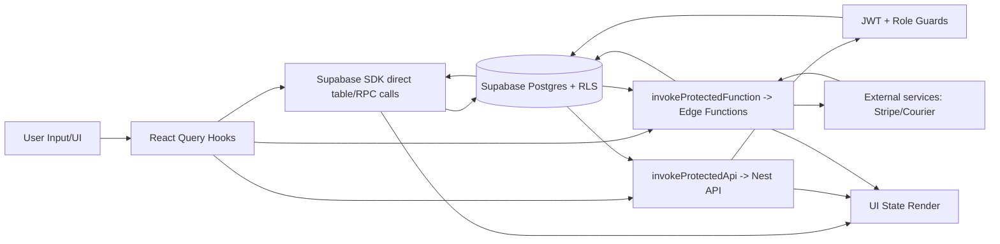
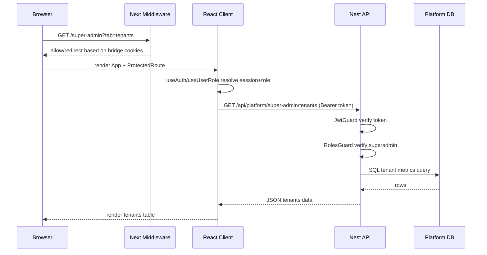

# RaheDeen Inventory SaaS - Architecture Analysis

Generated: 2026-03-10

## 1. Project Overview

### What this project is
This is a multi-tenant SaaS inventory and sales system with:
- Tenant-facing app: products, sales, inventory, customers, reports, invoices, alerts, settings.
- Super-admin control plane: tenant metrics, tenant requests, platform-level reporting.
- Supabase-backed auth/data with Edge Functions.
- Dedicated NestJS API for platform and super-admin endpoints.

Evidence:
- `src/App.tsx#L103`
- `src/views/SuperAdminDashboard.tsx#L121`
- `apps/api/src/modules/platform-super-admin/platform-super-admin.controller.ts#L8`

### Tech stack and key dependencies
- Next.js 15 App Router shell: `app/layout.tsx#L26`
- Legacy React app mounted via Next catch-all route: `app/[[...slug]]/page.tsx#L5`
- React 18 + `react-router-dom` + TanStack Query: `src/App.tsx#L7`, `src/App.tsx#L40`
- Supabase SDK: `src/integrations/supabase/client.ts#L2`
- NestJS + pg backend: `apps/api/package.json#L13`
- Supabase Edge Functions (Deno): `supabase/functions/*`
- CI/CD + PM2 + VPS: `.github/workflows/deploy.yml#L95`, `Ecosystem.config.js#L4`

### Folder and module structure
- `app/`: Next shell, middleware, health route
- `src/`: main React app (views, hooks, components, utils)
- `apps/api/`: Nest API controllers, guards, services, DB layer
- `supabase/`: migrations, edge functions, config
- `scripts/`: local orchestration and helper scripts
- `.github/workflows/`: quality checks, deployment, migrations, edge deploy

## 2. Code Flow Analysis

### Entry points
1. Web shell:
   - `app/layout.tsx#L26`
   - `app/[[...slug]]/page.tsx#L5`
2. React composition root:
   - `src/next/LegacyAppClient.tsx#L10`
   - `src/App.tsx#L187`
3. Nest API:
   - `apps/api/src/main.ts#L8`

### Execution path (web)
1. Next catch-all dynamically imports legacy client (`app/[[...slug]]/page.tsx#L10`).
2. `LegacyAppClient` initializes PWA/theme and mounts `App` under `ErrorBoundary`.
3. `App` wires providers (QueryClient, Theme, Auth, Settings, Router).
4. `ProtectedRoute` enforces auth/role/tenant/permission checks.
5. `/super-admin` route mounts `SuperAdminDashboard`.
6. Dashboard loads data via `invokeProtectedApi`.

### Execution path (API)
1. Nest bootstrap sets CORS, `/api` prefix, and global validation pipe.
2. `AppModule` registers controllers/services/guards.
3. `/api/platform/super-admin/*` hits `JwtGuard` then `RolesGuard`.
4. Controller delegates to service.
5. Service executes SQL through `PlatformDbService`.

### Major modules and responsibilities
- `AuthProvider`: auth session lifecycle + auth bridge cookies (`src/hooks/useAuth.tsx#L41`)
- `useUserRole`: role/permission resolution + realtime invalidation (`src/hooks/useUserRole.tsx#L8`)
- `ProtectedRoute`: role/permission/tenant gating (`src/components/ProtectedRoute.tsx#L19`)
- Next middleware route gate (`middleware.ts#L49`)
- `invokeProtectedApi`: session refresh + bearer auth + runtime URL adaptation
- Nest guards: token and role enforcement
- `PlatformSuperAdminService`: platform aggregate queries
- Edge function workflows: signup, request approval, billing, webhook processing

### Background and event-driven parts
- Next middleware chain (`middleware.ts`)
- Client listeners (auth state, realtime subscriptions, service worker update polling)
- DB scheduler via `pg_cron` migration (`20260211030000_auto_refresh_cron.sql#L120`)
- CI scheduled backup workflow (`.github/workflows/backup.yaml#L5`)

## 3. Data Flow Analysis

### Data ingress
- Browser forms and user actions
- Nest API requests (`/api/*`)
- Supabase Edge Function HTTP invocations
- Stripe webhook events
- Courier API responses via proxy functions

### Validation and transformation
- UI validation in form handlers
- Global Nest ValidationPipe
- Guard chain (`JwtGuard`, `RolesGuard`)
- Edge function payload validation/sanitization helpers

### Persistence
- Supabase Postgres as primary persistence layer
- API DB pooling via `pg` (`PlatformDbService`)
- Browser local storage for theme prefs
- Browser cookies for middleware auth bridge

### Data egress
- JSON responses from Nest and Edge Functions
- OTP/email notifications through Supabase auth flows
- Outbound requests to Stripe and courier providers

### Pipelines and queues
- No active BullMQ/Temporal runtime workers found in current execution paths (inference from current code scan)
- `pg_cron` driven scheduled status refresh in SQL migrations
- CI workflows for backup/migration/deploy

### State management
- Server state: TanStack Query (`useQuery`, `useMutation`)
- Auth/session: `useAuth` context
- Role/tenant state: `useUserRole`, `useTenantMembership`
- UI local state: `useState`
- Route state: URL search params (e.g., `tab`, `tenantId`)

## 4. Project Lifecycle

### Startup
- Local startup orchestration: `scripts/dev-server.mjs#L217`
- Env loading: `scripts/dev-env.mjs#L5`
- API boot sequence: `apps/api/src/main.ts#L13`

### Request lifecycle
- Web:
  - Next middleware pre-routing by session/role/tenant cookies
  - Client-side `ProtectedRoute` checks
  - Data loaded from Supabase SDK or protected API helpers
- API:
  - CORS -> Guards -> Controller -> Service -> DB -> Response

### Error handling
- React `ErrorBoundary` fallback UI
- API connectivity diagnostics in `invokeProtectedApi`
- DB connectivity errors mapped to `503 ServiceUnavailableException`
- Edge functions generally return structured JSON errors

### Shutdown
- Nest DB pool closes in `onModuleDestroy`
- Dev orchestrator terminates child processes on stop/restart

### Config and deployment
- Next env mapping in `next.config.ts`
- API env schema in `apps/api/src/infra/config/env.ts`
- Build/deploy workflows in `.github/workflows/*`

## 5. Existing Integration Points and Extension Hooks

### Extension-ready areas
- React route table (`src/App.tsx`)
- Sidebar/nav maps (`src/components/AppSidebar.tsx`)
- Nest decorators/guards and module boundaries
- Shared edge helper layer (`supabase/functions/_shared`)

### Natural seams for new features
- UI feature: add view + hook + route + menu
- API feature: add module (controller/service) + register in `AppModule`
- Edge feature: add `supabase/functions/<feature>/index.ts`
- Schema feature: add migration SQL

### Typical files to touch
- `src/App.tsx`
- `src/views/*`
- `src/components/AppSidebar.tsx`
- `src/components/ProtectedRoute.tsx`
- `src/hooks/useUserRole.tsx`
- `apps/api/src/app.module.ts`
- `apps/api/src/modules/<feature>/*`
- `supabase/migrations/*.sql`
- `supabase/functions/<feature>/index.ts`
- `supabase/config.toml`

### Patterns already in use
- Controller-Service layering (Nest)
- Guard + decorator based authorization
- Query/Mutation hooks (TanStack Query)
- Shared utility modules for cross-cutting concerns
- SQL-centric data access via `PlatformDbService`

## 6. How New Modules Will Fit

### Placement
- UI module: `src/views/<Feature>.tsx` + `src/hooks/use<Feature>.tsx`
- API module: `apps/api/src/modules/<feature>/`
- Edge function: `supabase/functions/<feature>/index.ts`
- DB schema: `supabase/migrations/<timestamp>_<feature>.sql`

### Registration/bootstrap
- UI route registration in `src/App.tsx`
- API registration in `apps/api/src/app.module.ts`
- Edge auto-discovery in deploy workflow + `verify_jwt` in `supabase/config.toml`
- Migration pipeline applies `supabase/migrations/**`

### Data contracts and reuse
- Protected API calls: `invokeProtectedApi`
- Protected edge calls: `invokeProtectedFunction`
- Reuse: `useUserRole`, `useTenantMembership`, `ProtectedRoute`, `runtimeUrls`, `authBridge`, edge `_shared` helpers

### Conventions and constraints
- Naming: hooks `useXxx`, views `PascalCase`, query keys as arrays
- Error handling: explicit user-actionable errors + toast/card surfacing
- Testing: current automation is minimal; RLS test script exists
- Notable constraints:
  - Hybrid Next + legacy artifacts coexist (`src/main.tsx`, `index.html`)
  - `ignoreBuildErrors` and `ignoreDuringBuilds` are enabled in Next config
  - `decryptRegistrySecret` is currently stubbed in tenant DB manager
  - Some edge functions still use wildcard CORS while secure shared CORS exists
  - `Route.ts` appears to duplicate health-route logic

## 7. Visual Summary

### Module dependency diagram
```mermaid
graph TD
  Browser --> NextMiddleware[middleware.ts]
  NextMiddleware --> CatchAll[app/[[...slug]]/page.tsx]
  CatchAll --> LegacyClient[src/next/LegacyAppClient.tsx]
  LegacyClient --> App[src/App.tsx]

  App --> AuthProvider[src/hooks/useAuth.tsx]
  App --> ProtectedRoute[src/components/ProtectedRoute.tsx]
  App --> SuperAdminUI[src/views/SuperAdminDashboard.tsx]
  App --> SupabaseClient[src/integrations/supabase/client.ts]

  SuperAdminUI --> InvokeAPI[src/utils/invokeProtectedApi.ts]
  InvokeAPI --> NestAPI[apps/api Nest API]

  NestAPI --> JwtGuard[JwtGuard]
  NestAPI --> RolesGuard[RolesGuard]
  NestAPI --> SuperAdminController[PlatformSuperAdminController]
  SuperAdminController --> SuperAdminService[PlatformSuperAdminService]
  SuperAdminService --> PlatformDb[PlatformDbService]
  PlatformDb --> Postgres[(Supabase Postgres)]

  App --> InvokeFn[src/utils/invokeProtectedFunction.ts]
  InvokeFn --> EdgeFns[supabase/functions/*]
  EdgeFns --> Postgres
  EdgeFns --> Stripe[Stripe/Courier APIs]
```

### Data flow diagram


### Lifecycle sequence diagram (typical `/super-admin?tab=tenants`)

